# 架构概览

本文档提供 OpenClaw 项目的完整架构概览，包括系统级架构图、各模块架构图以及完整的依赖树。

---

## 1. 系统顶层架构

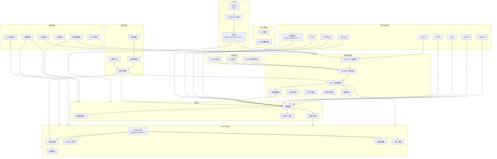

---

## 2. 消息流转架构

收发消息的核心数据流：

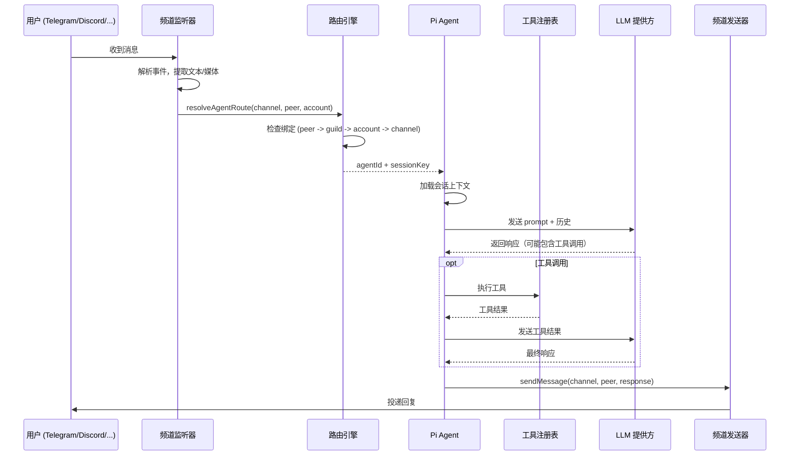

---

## 3. 分模块架构图

### 3.1 CLI 模块 (`src/cli/`)

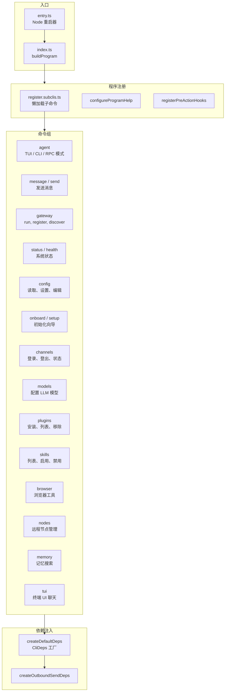

### 3.2 网关模块 (`src/gateway/`)

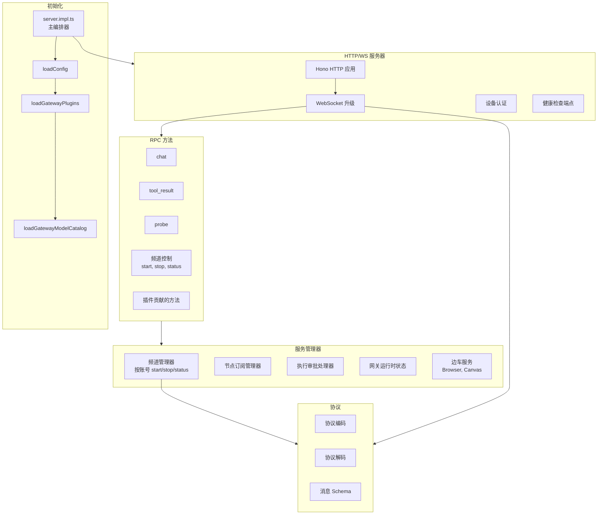

### 3.3 频道层 (`src/channels/` + `src/telegram/`、`src/discord/` 等)

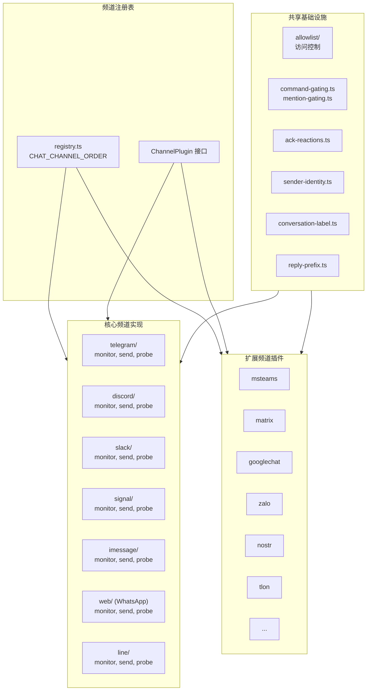

### 3.4 Agent 运行时 (`src/agents/`)

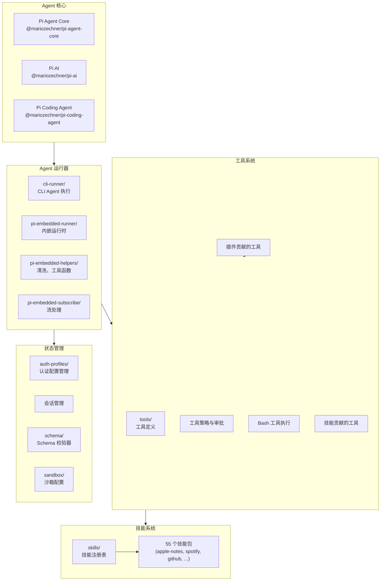

### 3.5 插件系统 (`src/plugins/`)

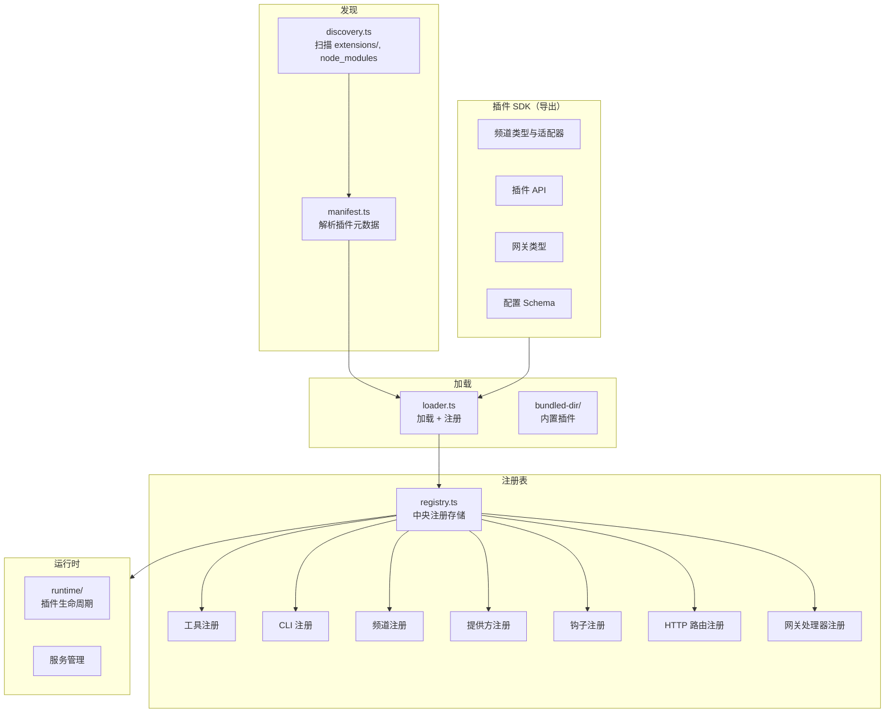

### 3.6 媒体管道 (`src/media/`)

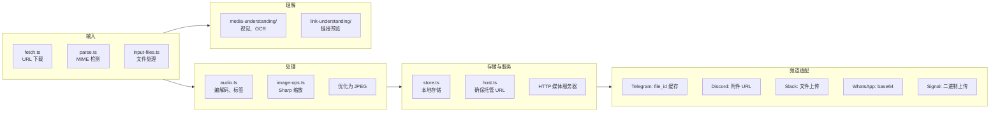

### 3.7 路由引擎 (`src/routing/`)

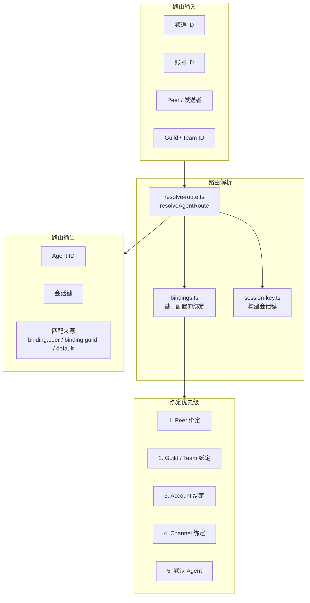

### 3.8 基础设施 (`src/infra/`)

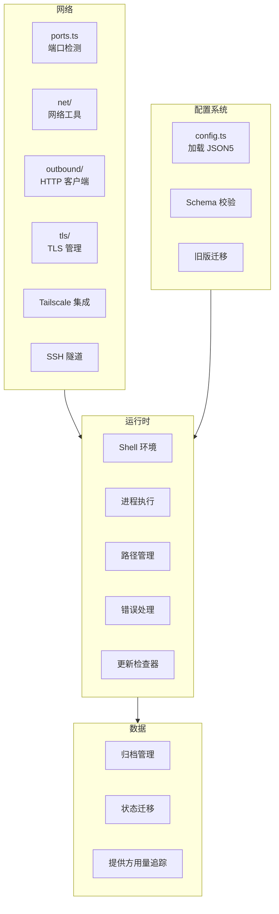

### 3.9 原生应用架构

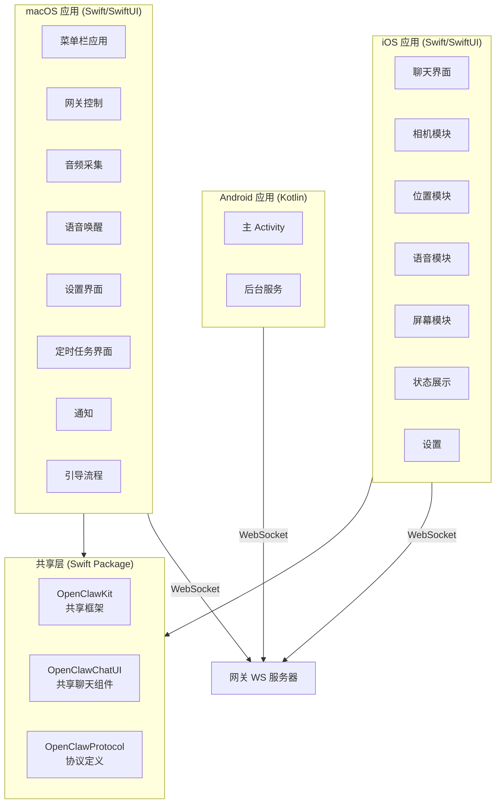

---

## 4. 工作区包依赖树

```mermaid
graph TB
    subgraph Root["openclaw（根包）"]
        ROOT_PKG["openclaw v2026.2.1<br/>主 CLI + 网关"]
    end

    subgraph Shims["兼容性垫片"]
        CLAWDBOT["clawdbot<br/>-> openclaw (workspace:*)"]
        MOLTBOT["moltbot<br/>-> openclaw (workspace:*)"]
    end

    subgraph UI["Web UI"]
        UI_PKG["openclaw-control-ui<br/>(Lit + Vite)"]
    end

    subgraph Extensions["扩展（30 个包）"]
        subgraph ChannelExt["频道扩展（无运行时依赖）"]
            E_DC["@openclaw/discord"]
            E_TG["@openclaw/telegram"]
            E_SL["@openclaw/slack"]
            E_SG["@openclaw/signal"]
            E_IM["@openclaw/imessage"]
            E_WA["@openclaw/whatsapp"]
            E_LN["@openclaw/line"]
            E_BB["@openclaw/bluebubbles"]
            E_MT["@openclaw/msteams"]
            E_MX["@openclaw/matrix"]
            E_MM["@openclaw/mattermost"]
            E_GC["@openclaw/googlechat"]
            E_NC["@openclaw/nextcloud-talk"]
            E_TL["@openclaw/tlon"]
            E_TW["@openclaw/twitch"]
            E_ZA["@openclaw/zalo"]
            E_ZU["@openclaw/zalouser"]
            E_NO["@openclaw/nostr"]
            E_LO["@openclaw/lobster"]
        end

        subgraph FeatureExt["功能扩展"]
            E_MC["@openclaw/memory-core<br/>（无依赖）"]
            E_ML["@openclaw/memory-lancedb<br/>-> @lancedb/lancedb, openai"]
            E_VC["@openclaw/voice-call<br/>-> ws, typebox, zod"]
            E_LT["@openclaw/llm-task<br/>（无依赖）"]
            E_OP["@openclaw/open-prose<br/>（无依赖）"]
        end

        subgraph AuthExt["认证扩展（无运行时依赖）"]
            E_CP["@openclaw/copilot-proxy"]
            E_GA["@openclaw/google-antigravity-auth"]
            E_GG["@openclaw/google-gemini-cli-auth"]
            E_MP["@openclaw/minimax-portal-auth"]
            E_QP["@openclaw/qwen-portal-auth"]
        end

        subgraph ObsExt["可观测性"]
            E_OT["@openclaw/diagnostics-otel<br/>-> @opentelemetry/* (10 个包)"]
        end
    end

    ROOT_PKG -.->|"导出 plugin-sdk"| Extensions
    CLAWDBOT -->|"workspace:*"| ROOT_PKG
    MOLTBOT -->|"workspace:*"| ROOT_PKG
    Extensions -.->|"devDependencies"| ROOT_PKG
    UI_PKG -.->|"独立"| ROOT_PKG
```

---

## 5. 外部依赖树

### 5.1 核心运行时依赖

```
openclaw v2026.2.1
│
├─── AI / Agent 框架
│    ├── @mariozechner/pi-agent-core (0.51.1)
│    ├── @mariozechner/pi-ai (0.51.1)
│    ├── @mariozechner/pi-coding-agent (0.51.1)
│    ├── @mariozechner/pi-tui (0.51.1)
│    └── @agentclientprotocol/sdk (0.13.1)
│
├─── Web / HTTP
│    ├── hono (4.11.7)              — HTTP 框架（网关）
│    ├── express (5.2.1)            — 旧版 HTTP 支持
│    ├── undici (7.20.0)            — HTTP 客户端
│    └── ws (8.19.0)                — WebSocket
│
├─── 聊天平台 SDK
│    ├── grammy (1.39.3)            — Telegram Bot API
│    ├── discord-api-types (0.38.38)— Discord 类型
│    ├── @slack/bolt (4.6.0)        — Slack 框架
│    ├── @slack/web-api (7.13.0)    — Slack Web API
│    ├── @line/bot-sdk (10.6.0)     — LINE Messaging API
│    └── @whiskeysockets/baileys (7.0.0-rc.9) — WhatsApp Web
│
├─── 媒体处理
│    ├── sharp (0.34.5)             — 图像处理
│    ├── pdfjs-dist (5.4.624)       — PDF 解析
│    ├── @napi-rs/canvas            — Canvas 渲染（peer）
│    └── jszip (3.10.1)             — ZIP 处理
│
├─── CLI / 终端 UI
│    ├── commander (14.0.3)         — CLI 框架
│    ├── chalk (5.6.2)              — 终端颜色
│    ├── @clack/prompts (1.0.0)     — 交互式提示
│    └── osc-progress (0.3.0)       — 进度条
│
├─── Schema / 校验
│    ├── @sinclair/typebox (0.34.48)— JSON Schema 构建器
│    └── zod (4.3.6)                — Schema 校验
│
├─── 云服务 / 提供方
│    └── @aws-sdk/client-bedrock (3.981.0) — AWS Bedrock
│
├─── 数据库
│    └── sqlite-vec (0.1.7-alpha.2) — 向量 SQLite
│
├─── 内容处理
│    ├── markdown-it (14.1.0)       — Markdown 解析器
│    ├── linkedom (0.18.12)         — DOM 解析器
│    └── yaml (2.8.2)               — YAML 解析器
│
├─── 运行时
│    ├── jiti (2.6.1)               — TS 运行时加载器
│    ├── dotenv (17.2.3)            — 环境变量
│    ├── proper-lockfile (4.1.2)    — 文件锁
│    └── playwright-core (1.58.1)   — 浏览器自动化
│
└─── Peer 依赖（可选）
     ├── @napi-rs/canvas (^0.1.89)
     └── node-llama-cpp (3.15.1)    — 本地 LLM
```

### 5.2 开发依赖

```
openclaw（开发）
│
├─── 构建
│    ├── tsdown (0.20.1)            — TypeScript 打包器
│    ├── rolldown (1.0.0-rc.2)      — 模块打包器
│    └── tsx (4.21.0)               — TS 执行器
│
├─── 类型系统
│    ├── typescript (5.9.3)
│    ├── @typescript/native-preview (7.0.0-dev)
│    └── @types/* (node, express, ws, ...)
│
├─── 代码检查 / 格式化
│    ├── oxlint (1.43.0)            — 基于 Rust 的 Linter
│    └── oxfmt (0.28.0)             — 基于 Rust 的 Formatter
│
└─── 测试
     ├── vitest (4.0.18)            — 测试框架
     └── @vitest/coverage-v8        — 覆盖率引擎
```

### 5.3 扩展依赖

```
扩展
│
├─── @openclaw/memory-lancedb
│    ├── @lancedb/lancedb (0.23.0)
│    ├── @sinclair/typebox (0.34.48)
│    └── openai (6.17.0)
│
├─── @openclaw/voice-call
│    ├── @sinclair/typebox (0.34.48)
│    ├── ws (8.19.0)
│    └── zod (4.3.6)
│
├─── @openclaw/diagnostics-otel
│    ├── @opentelemetry/api (~1.9.0)
│    ├── @opentelemetry/sdk-trace-base
│    ├── @opentelemetry/sdk-metrics
│    ├── @opentelemetry/sdk-logs
│    ├── @opentelemetry/exporter-trace-otlp-http
│    ├── @opentelemetry/exporter-metrics-otlp-http
│    ├── @opentelemetry/exporter-logs-otlp-http
│    ├── @opentelemetry/resources
│    └── @opentelemetry/semantic-conventions
│
├─── @openclaw/copilot-proxy .......... （无运行时依赖）
├─── @openclaw/google-*-auth .......... （无运行时依赖）
├─── @openclaw/memory-core ............ （无运行时依赖）
├─── @openclaw/llm-task ............... （无运行时依赖）
├─── @openclaw/open-prose ............. （无运行时依赖）
└─── 全部 19 个频道扩展 ............... （无运行时依赖）
```

### 5.4 Web UI 依赖

```
openclaw-control-ui
│
├─── 运行时
│    ├── lit (3.3.2)                — Web 组件框架
│    ├── marked (17.0.1)            — Markdown 渲染
│    ├── dompurify (3.3.1)          — HTML 消毒
│    └── @noble/ed25519 (3.0.0)     — 密码学
│
└─── 开发
     ├── vite (7.3.1)              — 构建工具
     ├── vitest (4.0.18)           — 测试
     └── playwright (1.58.1)       — 浏览器测试
```

---

## 6. 内部模块依赖关系图

展示 `src/` 各模块之间的依赖关系（简化版，仅保留主要依赖边）：

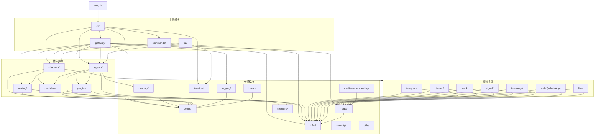

---

## 7. 技能生态

```
skills/（55 个包）
│
├─── 效率工具
│    ├── apple-notes          — Apple Notes 集成
│    ├── apple-reminders      — Apple Reminders
│    ├── bear-notes           — Bear 笔记应用
│    ├── obsidian             — Obsidian 仓库访问
│    ├── notion               — Notion API
│    ├── trello               — Trello 看板
│    ├── things-mac           — Things 3 (macOS)
│    └── tmux                 — tmux 会话控制
│
├─── 通讯
│    ├── discord              — Discord 工具
│    └── slack                — Slack 工具
│
├─── 娱乐
│    ├── spotify-player       — Spotify 控制
│    ├── songsee              — 歌曲识别
│    ├── gifgrep              — GIF 搜索
│    └── camsnap              — 摄像头抓拍
│
├─── 开发
│    ├── coding-agent         — 代码生成 Agent
│    ├── canvas               — Canvas 渲染
│    ├── github               — GitHub API
│    └── himalaya             — 邮件客户端
│
├─── 服务与 API
│    ├── 1password            — 1Password 集成
│    ├── weather              — 天气数据
│    ├── goplaces             — 地点搜索
│    ├── food-order           — 外卖点餐
│    └── healthcheck          — 服务监控
│
├─── AI / 媒体
│    ├── openai-image-gen     — DALL-E 图像生成
│    ├── openai-whisper       — Whisper 语音转文字
│    ├── openai-whisper-api   — Whisper API
│    ├── sherpa-onnx-tts      — 文字转语音
│    └── video-frames         — 视频帧提取
│
└─── 系统
     ├── session-logs         — 会话日志查看器
     ├── model-usage          — 模型用量统计
     ├── blogwatcher          — 博客监控
     └── bird                 — 系统集成
```

---

## 8. 构建与 CI 流水线

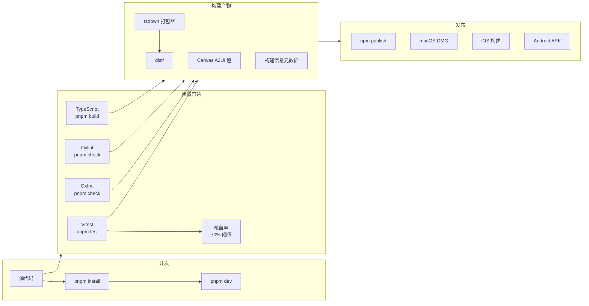

---

## 9. 部署拓扑

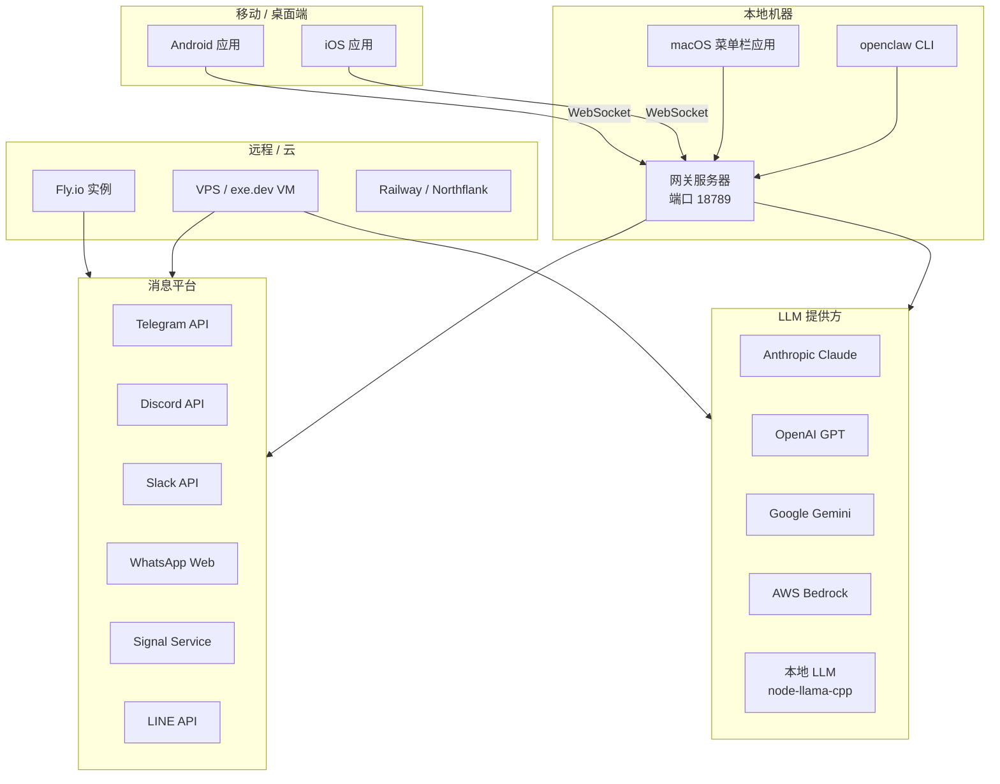

---

## 10. 项目统计概览

| 指标 | 数值 |
|------|------|
| 顶层目录 | 14 个主要目录 |
| src/ 子目录 | 52 个模块 |
| CLI 文件数 | 105 个 |
| 扩展包数 | 30 个 |
| 技能包数 | 55 个 |
| 文档分类 | 24 个 |
| 脚本数量 | 60+ |
| 原生平台 | 3 个（macOS、iOS、Android） |
| 消息频道 | 23+ 个已集成平台 |
| 核心运行时依赖 | 43 个 |
| 开发依赖 | 13 个 |
| 有运行时依赖的扩展 | 3 个（memory-lancedb、voice-call、diagnostics-otel） |
| 无运行时依赖的扩展 | 27 个 |
