# Architecture Overview

This document provides a comprehensive architectural overview of the OpenClaw project, including system-level diagrams, per-module breakdowns, and the full dependency tree.

---

## 1. High-Level System Architecture

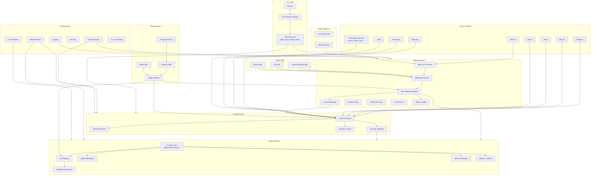

---

## 2. Message Flow Architecture

The core data flow for receiving and responding to messages:

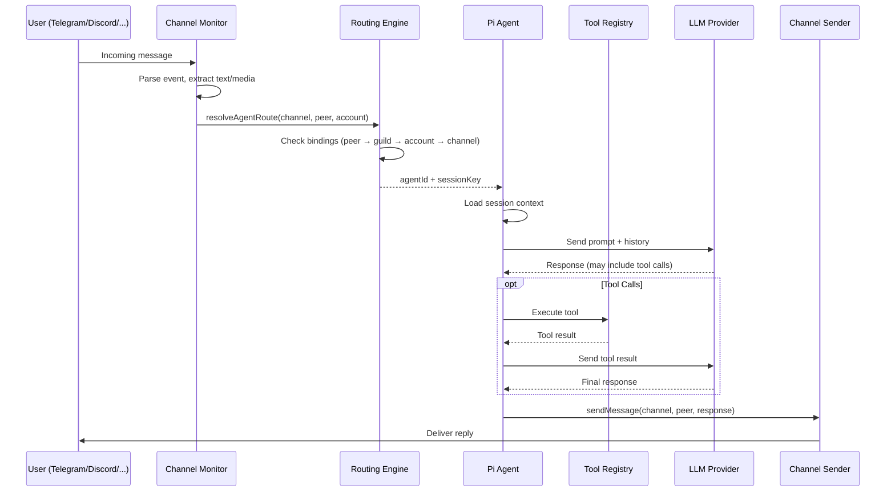

---

## 3. Module Architecture Diagrams

### 3.1 CLI Module (`src/cli/`)

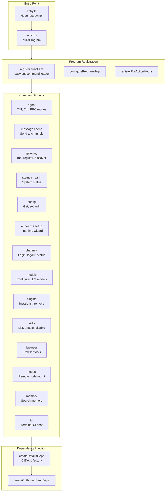

### 3.2 Gateway Module (`src/gateway/`)

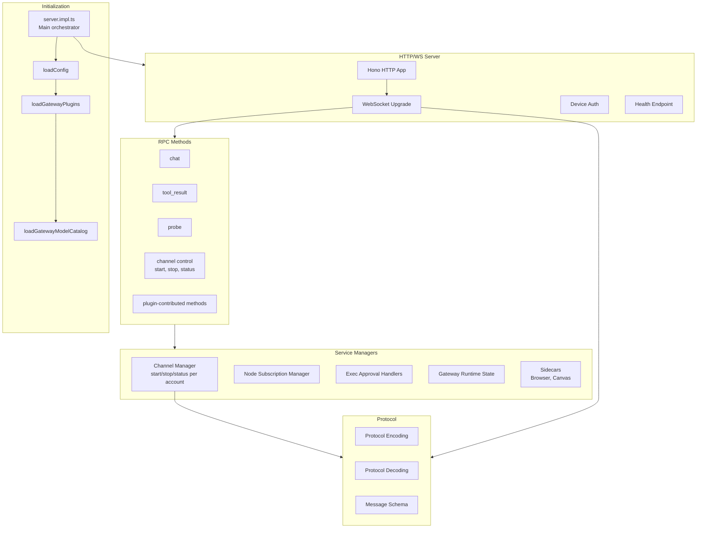

### 3.3 Channel Layer (`src/channels/` + `src/telegram/`, `src/discord/`, etc.)

```mermaid
graph TB
    subgraph Registry["Channel Registry"]
        REG[registry.ts<br/>CHAT_CHANNEL_ORDER]
        PLUGIN_TYPE[ChannelPlugin interface]
    end

    subgraph Shared["Shared Infrastructure"]
        ALLOW[allowlist/<br/>Access control]
        GATING[command-gating.ts<br/>mention-gating.ts]
        ACK[ack-reactions.ts]
        SENDER[sender-identity.ts]
        LABEL[conversation-label.ts]
        PREFIX[reply-prefix.ts]
    end

    subgraph CoreChannels["Core Channel Implementations"]
        TG_MOD[telegram/<br/>monitor, send, probe]
        DC_MOD[discord/<br/>monitor, send, probe]
        SL_MOD[slack/<br/>monitor, send, probe]
        SG_MOD[signal/<br/>monitor, send, probe]
        IM_MOD[imessage/<br/>monitor, send, probe]
        WA_MOD[web/ (WhatsApp)<br/>monitor, send, probe]
        LN_MOD[line/<br/>monitor, send, probe]
    end

    subgraph ExtChannels["Extension Channel Plugins"]
        TEAMS[msteams]
        MATRIX[matrix]
        GCHAT[googlechat]
        ZALO[zalo]
        NOSTR[nostr]
        TLON[tlon]
        MORE[...]
    end

    REG --> CoreChannels
    REG --> ExtChannels
    PLUGIN_TYPE --> CoreChannels
    PLUGIN_TYPE --> ExtChannels
    Shared --> CoreChannels
    Shared --> ExtChannels
```

### 3.4 Agent Runtime (`src/agents/`)

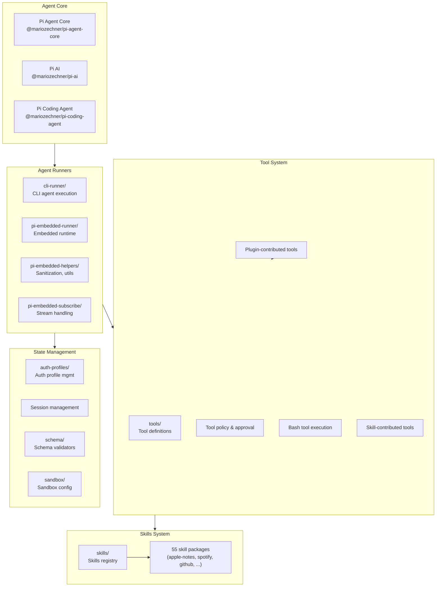

### 3.5 Plugin System (`src/plugins/`)

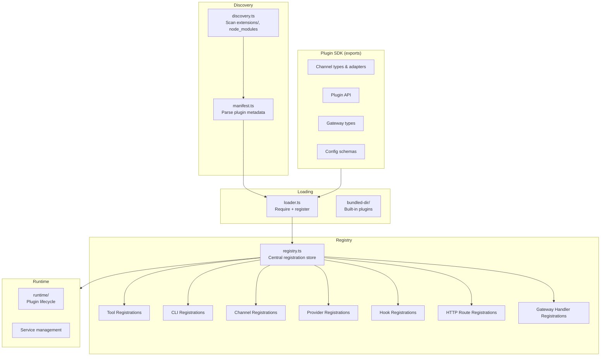

### 3.6 Media Pipeline (`src/media/`)

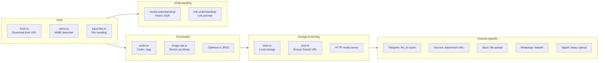

### 3.7 Routing Engine (`src/routing/`)

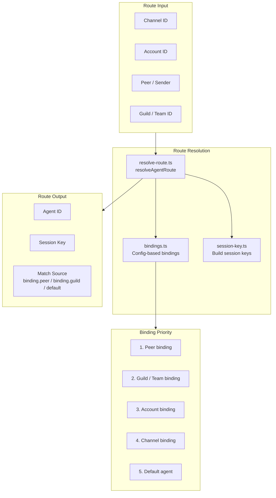

### 3.8 Infrastructure (`src/infra/`)

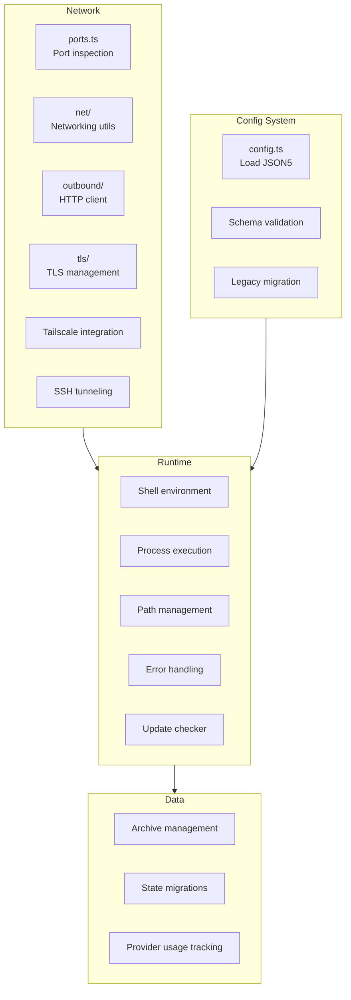

### 3.9 Native Apps Architecture

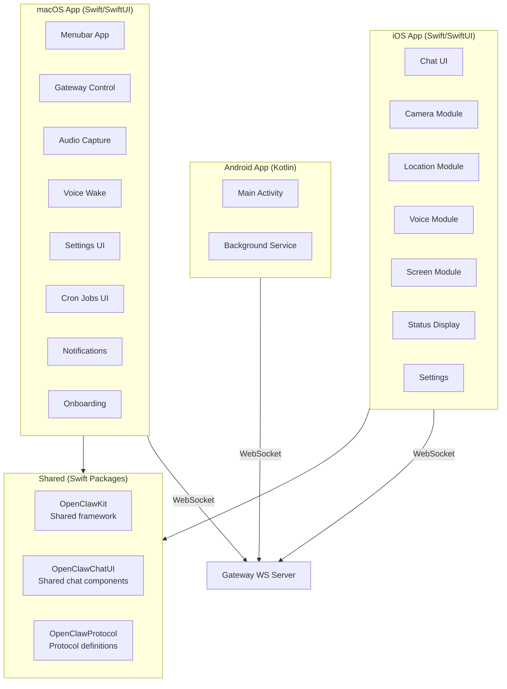

---

## 4. Workspace Package Dependency Tree

```mermaid
graph TB
    subgraph Root["openclaw (root)"]
        ROOT_PKG["openclaw v2026.2.1<br/>Main CLI + Gateway"]
    end

    subgraph Shims["Compatibility Shims"]
        CLAWDBOT["clawdbot<br/>→ openclaw (workspace:*)"]
        MOLTBOT["moltbot<br/>→ openclaw (workspace:*)"]
    end

    subgraph UI["Web UI"]
        UI_PKG["openclaw-control-ui<br/>(Lit + Vite)"]
    end

    subgraph Extensions["Extensions (30 packages)"]
        subgraph ChannelExt["Channel Extensions (no runtime deps)"]
            E_DC["@openclaw/discord"]
            E_TG["@openclaw/telegram"]
            E_SL["@openclaw/slack"]
            E_SG["@openclaw/signal"]
            E_IM["@openclaw/imessage"]
            E_WA["@openclaw/whatsapp"]
            E_LN["@openclaw/line"]
            E_BB["@openclaw/bluebubbles"]
            E_MT["@openclaw/msteams"]
            E_MX["@openclaw/matrix"]
            E_MM["@openclaw/mattermost"]
            E_GC["@openclaw/googlechat"]
            E_NC["@openclaw/nextcloud-talk"]
            E_TL["@openclaw/tlon"]
            E_TW["@openclaw/twitch"]
            E_ZA["@openclaw/zalo"]
            E_ZU["@openclaw/zalouser"]
            E_NO["@openclaw/nostr"]
            E_LO["@openclaw/lobster"]
        end

        subgraph FeatureExt["Feature Extensions"]
            E_MC["@openclaw/memory-core<br/>(no deps)"]
            E_ML["@openclaw/memory-lancedb<br/>→ @lancedb/lancedb, openai"]
            E_VC["@openclaw/voice-call<br/>→ ws, typebox, zod"]
            E_LT["@openclaw/llm-task<br/>(no deps)"]
            E_OP["@openclaw/open-prose<br/>(no deps)"]
        end

        subgraph AuthExt["Auth Extensions (no runtime deps)"]
            E_CP["@openclaw/copilot-proxy"]
            E_GA["@openclaw/google-antigravity-auth"]
            E_GG["@openclaw/google-gemini-cli-auth"]
            E_MP["@openclaw/minimax-portal-auth"]
            E_QP["@openclaw/qwen-portal-auth"]
        end

        subgraph ObsExt["Observability"]
            E_OT["@openclaw/diagnostics-otel<br/>→ @opentelemetry/* (10 pkgs)"]
        end
    end

    ROOT_PKG -.->|"exports plugin-sdk"| Extensions
    CLAWDBOT -->|"workspace:*"| ROOT_PKG
    MOLTBOT -->|"workspace:*"| ROOT_PKG
    Extensions -.->|"devDependencies"| ROOT_PKG
    UI_PKG -.->|"independent"| ROOT_PKG
```

---

## 5. External Dependency Tree

### 5.1 Core Runtime Dependencies

```
openclaw v2026.2.1
│
├─── AI / Agent Framework
│    ├── @mariozechner/pi-agent-core (0.51.1)
│    ├── @mariozechner/pi-ai (0.51.1)
│    ├── @mariozechner/pi-coding-agent (0.51.1)
│    ├── @mariozechner/pi-tui (0.51.1)
│    └── @agentclientprotocol/sdk (0.13.1)
│
├─── Web / HTTP
│    ├── hono (4.11.7)              — HTTP framework (gateway)
│    ├── express (5.2.1)            — Legacy HTTP support
│    ├── undici (7.20.0)            — HTTP client
│    └── ws (8.19.0)                — WebSocket
│
├─── Chat Platform SDKs
│    ├── grammy (1.39.3)            — Telegram Bot API
│    ├── discord-api-types (0.38.38)— Discord types
│    ├── @slack/bolt (4.6.0)        — Slack framework
│    ├── @slack/web-api (7.13.0)    — Slack Web API
│    ├── @line/bot-sdk (10.6.0)     — LINE Messaging API
│    └── @whiskeysockets/baileys (7.0.0-rc.9) — WhatsApp Web
│
├─── Media Processing
│    ├── sharp (0.34.5)             — Image processing
│    ├── pdfjs-dist (5.4.624)       — PDF parsing
│    ├── @napi-rs/canvas            — Canvas rendering (peer)
│    └── jszip (3.10.1)             — ZIP handling
│
├─── CLI / Terminal UI
│    ├── commander (14.0.3)         — CLI framework
│    ├── chalk (5.6.2)              — Terminal colors
│    ├── @clack/prompts (1.0.0)     — Interactive prompts
│    └── osc-progress (0.3.0)       — Progress bars
│
├─── Schema / Validation
│    ├── @sinclair/typebox (0.34.48)— JSON schema builder
│    └── zod (4.3.6)                — Schema validation
│
├─── Cloud / Providers
│    └── @aws-sdk/client-bedrock (3.981.0) — AWS Bedrock
│
├─── Database
│    └── sqlite-vec (0.1.7-alpha.2) — Vector SQLite
│
├─── Content Processing
│    ├── markdown-it (14.1.0)       — Markdown parser
│    ├── linkedom (0.18.12)         — DOM parser
│    └── yaml (2.8.2)               — YAML parser
│
├─── Runtime
│    ├── jiti (2.6.1)               — Runtime TS loader
│    ├── dotenv (17.2.3)            — Environment vars
│    ├── proper-lockfile (4.1.2)    — File locking
│    └── playwright-core (1.58.1)   — Browser automation
│
└─── Peer Dependencies (optional)
     ├── @napi-rs/canvas (^0.1.89)
     └── node-llama-cpp (3.15.1)    — Local LLM
```

### 5.2 Development Dependencies

```
openclaw (dev)
│
├─── Build
│    ├── tsdown (0.20.1)            — TypeScript bundler
│    ├── rolldown (1.0.0-rc.2)      — Module bundler
│    └── tsx (4.21.0)               — TS executor
│
├─── Type System
│    ├── typescript (5.9.3)
│    ├── @typescript/native-preview (7.0.0-dev)
│    └── @types/* (node, express, ws, ...)
│
├─── Lint / Format
│    ├── oxlint (1.43.0)            — Rust-based linter
│    └── oxfmt (0.28.0)             — Rust-based formatter
│
└─── Testing
     ├── vitest (4.0.18)            — Test framework
     └── @vitest/coverage-v8        — Coverage provider
```

### 5.3 Extension Dependencies

```
Extensions
│
├─── @openclaw/memory-lancedb
│    ├── @lancedb/lancedb (0.23.0)
│    ├── @sinclair/typebox (0.34.48)
│    └── openai (6.17.0)
│
├─── @openclaw/voice-call
│    ├── @sinclair/typebox (0.34.48)
│    ├── ws (8.19.0)
│    └── zod (4.3.6)
│
├─── @openclaw/diagnostics-otel
│    ├── @opentelemetry/api (~1.9.0)
│    ├── @opentelemetry/sdk-trace-base
│    ├── @opentelemetry/sdk-metrics
│    ├── @opentelemetry/sdk-logs
│    ├── @opentelemetry/exporter-trace-otlp-http
│    ├── @opentelemetry/exporter-metrics-otlp-http
│    ├── @opentelemetry/exporter-logs-otlp-http
│    ├── @opentelemetry/resources
│    └── @opentelemetry/semantic-conventions
│
├─── @openclaw/copilot-proxy .......... (no runtime deps)
├─── @openclaw/google-*-auth .......... (no runtime deps)
├─── @openclaw/memory-core ............ (no runtime deps)
├─── @openclaw/llm-task ............... (no runtime deps)
├─── @openclaw/open-prose ............. (no runtime deps)
└─── All 19 channel extensions ........ (no runtime deps)
```

### 5.4 Web UI Dependencies

```
openclaw-control-ui
│
├─── Runtime
│    ├── lit (3.3.2)                — Web components
│    ├── marked (17.0.1)            — Markdown rendering
│    ├── dompurify (3.3.1)          — HTML sanitization
│    └── @noble/ed25519 (3.0.0)     — Cryptography
│
└─── Dev
     ├── vite (7.3.1)              — Build tool
     ├── vitest (4.0.18)           — Testing
     └── playwright (1.58.1)       — Browser testing
```

---

## 6. Internal Module Dependency Map

Shows how `src/` modules depend on each other (simplified, major edges only):

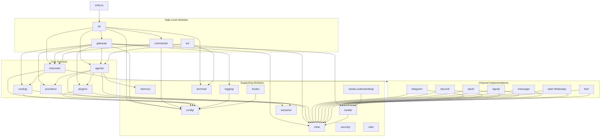

---

## 7. Skills Ecosystem

```
skills/ (55 packages)
│
├─── Productivity
│    ├── apple-notes          — Apple Notes integration
│    ├── apple-reminders      — Apple Reminders
│    ├── bear-notes           — Bear app notes
│    ├── obsidian             — Obsidian vault access
│    ├── notion               — Notion API
│    ├── trello               — Trello boards
│    ├── things-mac           — Things 3 (macOS)
│    └── tmux                 — tmux session control
│
├─── Communication
│    ├── discord              — Discord utilities
│    └── slack                — Slack utilities
│
├─── Entertainment
│    ├── spotify-player       — Spotify control
│    ├── songsee              — Song recognition
│    ├── gifgrep              — GIF search
│    └── camsnap              — Camera capture
│
├─── Development
│    ├── coding-agent         — Code generation agent
│    ├── canvas               — Canvas rendering
│    ├── github               — GitHub API
│    └── himalaya             — Email client
│
├─── Services & APIs
│    ├── 1password            — 1Password integration
│    ├── weather              — Weather data
│    ├── goplaces             — Places search
│    ├── food-order           — Food ordering
│    └── healthcheck          — Service monitoring
│
├─── AI / Media
│    ├── openai-image-gen     — DALL-E image generation
│    ├── openai-whisper       — Whisper transcription
│    ├── openai-whisper-api   — Whisper API
│    ├── sherpa-onnx-tts      — Text-to-speech
│    └── video-frames         — Video frame extraction
│
└─── System
     ├── session-logs         — Session log viewer
     ├── model-usage          — Model usage stats
     ├── blogwatcher          — Blog monitoring
     └── bird                 — System integration
```

---

## 8. Build & CI Pipeline

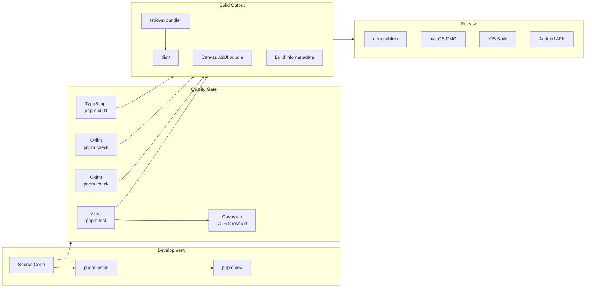

---

## 9. Deployment Topology

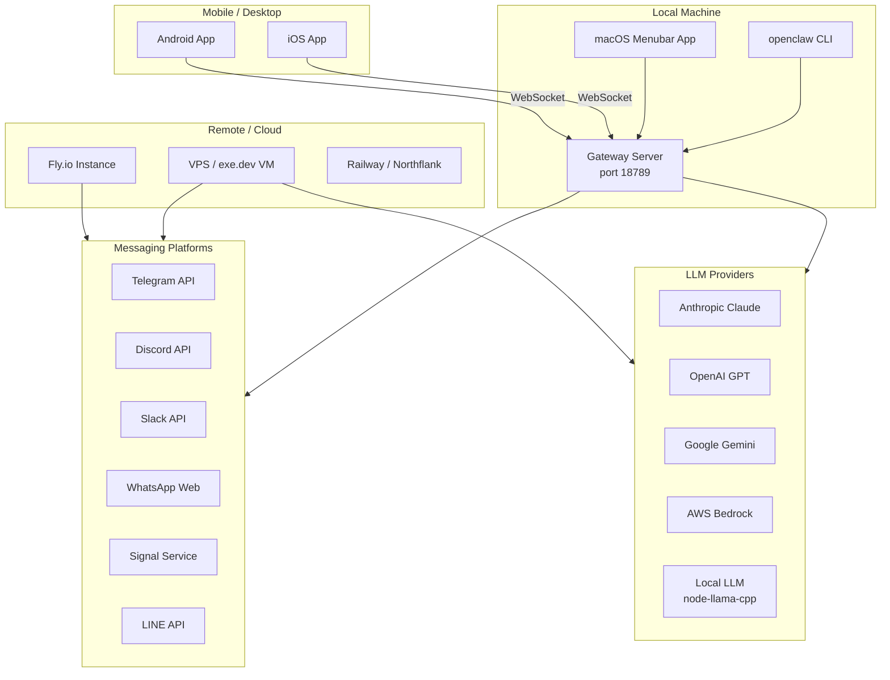
